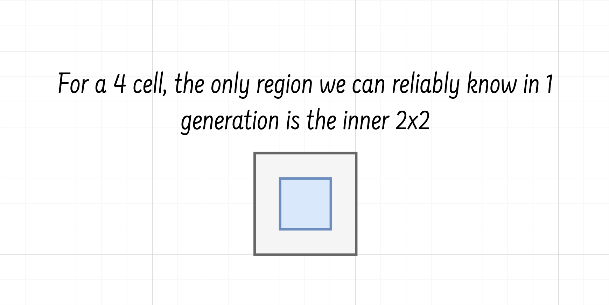
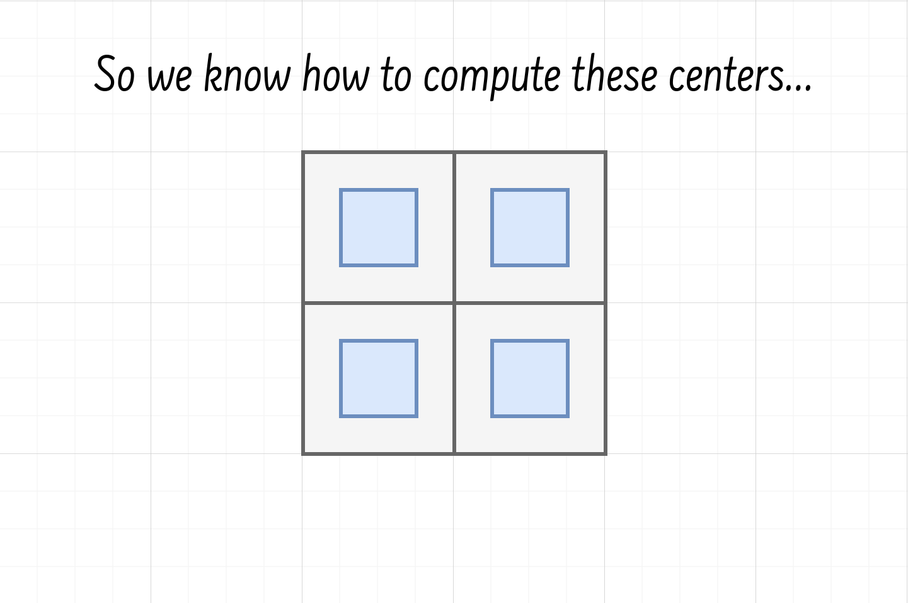
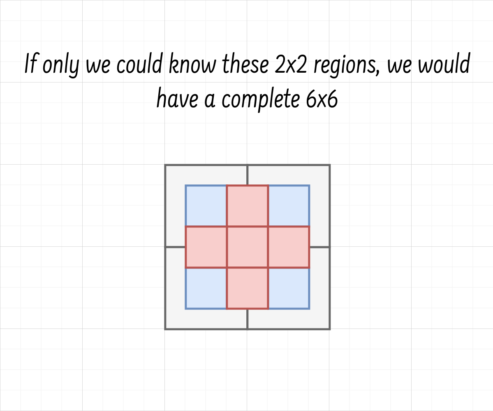
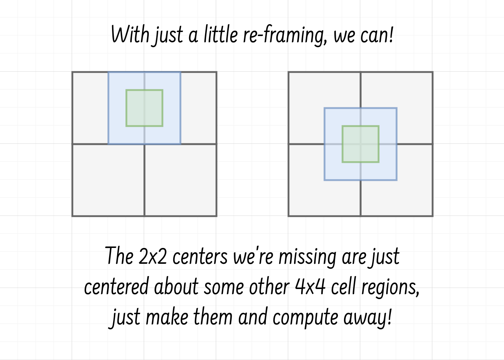
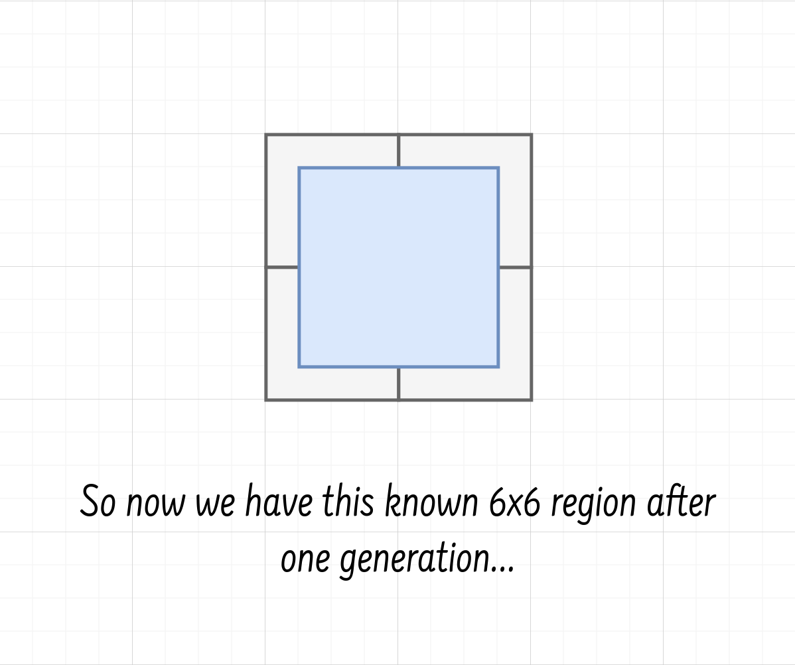
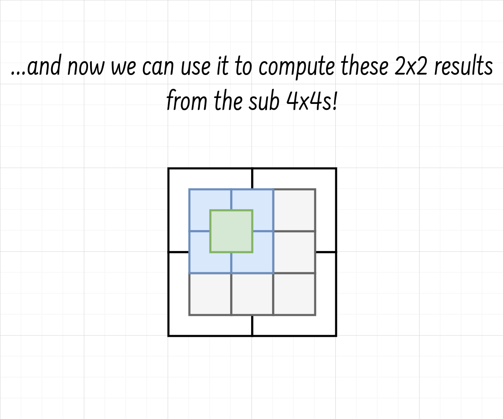
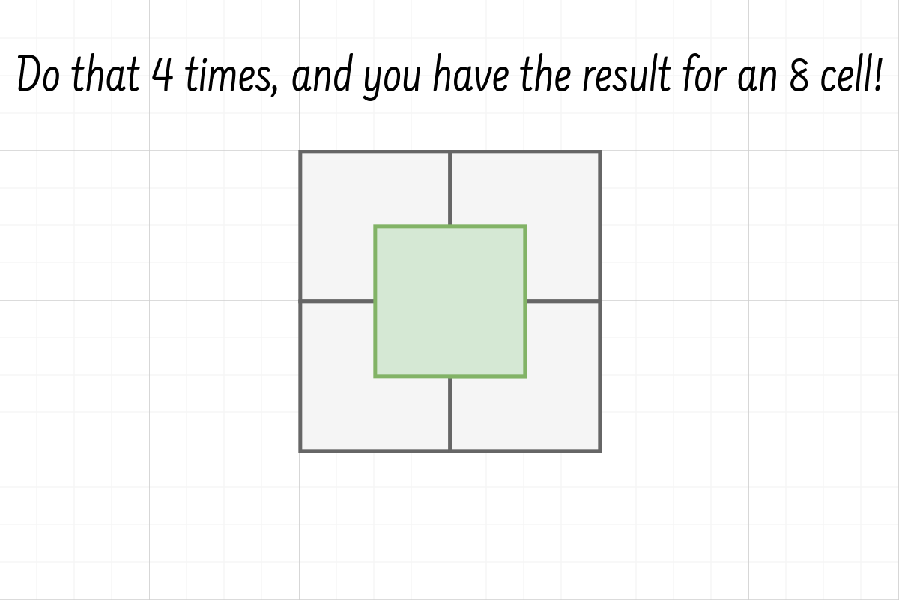

# `hashlife`

https://github.com/user-attachments/assets/029063b7-6db2-4712-9290-73109324a6f7

[Hashlife](https://en.wikipedia.org/wiki/Hashlife) is a program that efficiently
computes Conway's Game of Life in large universes. A simple program might take
as input an array of cells, and compute the next state on that array. What makes
Hashlife special is that it allows us to calculate many iterations in the
future, sometimes at no cost at all.

# Running the algorithm

First, git clone the repo
```
git clone https://github.com/llGaetanll/hashlife && cd hashlife
```

Then, you'll need some RLE files to run it with. You can get a great collection
of them [here](https://conwaylife.com/patterns/all.zip). The rle test suite
can parse all 5000 or so of these files.

Once you have your patterns, you can run the program with
```
cargo run --release -- <path/to/rlefile.rle>
```

This should open up a terminal live viewer with the pattern you loaded.

## Controls
- `<space>`: Toggle generation increment
- `[`: Decrease `k`, the speed of generation (halves each time)
- `]`: Increase `k`, the speed of generation (doubles each time)
- `shift + j`: Zoom out
- `shift + k`: Zoom in
- `h`: Move left
- `j`: Move down
- `k`: Move up
- `l`: Move right
- `0`: Reset camera location

**Note**: You can also use the mouse to scroll in and out for zooming as well as
for panning. You can use the `s` value in the navbar to see your zoom level.

**Note**: If you don't see the pattern you loaded immediately, zoom out a lot
until you see a small dot, then zoom back in on it.

**Note**: If your terminal doesn't support braille characters well, you can run
the program with a `--camera block` parameter to switch the rendering style

# How it works

There are three parts to Hashlife that make it clever. The first is how we store
the cells, the second is computing future world states, and the third is
re-using computation. We'll get to computing world states and memoization a bit
later but let's first talk about how the cells are stored.

## How Hashlife stores the cells

If you were to build a very simple program to compute Conway's Game of Life, it
might seem natural to store the cells as a 2D array of boolean values. Cell `(x,
y)` is alive if and only if `cells[x][y]` is `true`. Hashlife does not take this
approach. Instead, Hashlife builds the world from increasingly large square
cells. Start with a 1x1 cell (or a 1 cell), either dead or alive. Put 4 of these
in a 2x2 square and you get a 2 cell. Put 4 of these in a square and you get a 4
cell, and so on... In Hashlife, the entire world is stored as a QuadTree of
cells $2^k$ on a side. To be more specific, a world that is $2^{10} = 1024$ cells
on a side, can be decomposed as 4 cells `512` on a side. Each of those further
decompose until we get back down to the 1 cell.

In practice, we do not start at the 1 cell but at the 4 cell, as 4 cells require
exactly 16 bits of information, and store perfectly inside `u16`s. We then
compose four `u16` "rules" to build a "leaf", or an 8 cell.

## How Hashlife computes future world states

So we understand how the algorithm stores the world, but so far we haven't at all
explained how storing things this way allows us to compute Conway's Game of Life, let
alone doing so efficiently.

We start with our *rules* from earlier, the 4 cells. How can we compute the next
state of this cell? The key observation to make is that, for a 4 cell, we can
only really say anything about its 2x2 center, since the cells on the edges of
the 4x4 depend on their neighbors, whose states we dont know. However the inner
2x2, we know for sure. We have all the neighbors needed to compute the next
state.



Another neat fact is that there's not that many possible 4 cells, only $2^{16} =
65536$ in fact! A fun trick here is that we can compute the next state of all 4
cells. In fact we can store the result in an array where `arr[i]` is the
resulting 2x2 for the 4 cell represented by the number `i` (recall that we can
just store 4 cells as `u16`s, so it's just a number).

The natural question to ask is: if we know how to compute the result of a 4 cell
(its 2x2 center), how do we now compute the 4x4 result of an 8 cell? The goal
here is to build up the induction needed to do this for any $2^k$ cell.



The way that we want to do this is in two phases. If somehow we could compute
the center 6x6 of an 8 cell, we could then compute the resulting 4x4 center from
*it*.



Turns out we can actually compute this inner 6x6! All we need is to access the
right 4x4 regions to produce the 2x2 results that we want.



This is great! At this point we have our 8 cell, and we know the inner 6 cell
result.



The clever idea behind making this 6 cell is that we can decompose it into nine 2
cells. If we do this, and we select adjacent 2 cells to form our 4 cells, we can
compute their results and get a 2x2 center about *it*.



But the resulting 4 cell we're looking for is just doing that with the top left
, the top right, bottom left, and bottom right 2x2s, we can just compute the
results for each of those and merge those center 2x2s into a 4x4 result!



So that's it! Now we have the 4 cell result of an 8 cell! But in fact we have
more than that: this technique that we just used to produce the result of an 8
cell works for *any* $2^k$ cell for $k > 2$. What this means is that we can just
do this same trick again for 16 cells, 32 cells, and so on. We just completed
our induction!

One more thing to highlight on the example of the 8 cell. You'll notice that we
did two result passes in the steps described above. The first set was to compute
the inner 6x6, and the second was to compute the inner 4x4. This means that the
result of an 8 cell is actually 2 generations ahead. In general this
holds true. When we have a $2^k$ cell, we compute its $2^{k - 1}$ result which
is $2^{k - 2}$ generations ahead. The proof of this is just induction.

## Re-using Computation - What makes Hashlife so efficient

Now we understand how to compute future world states in Hashlife, but how in the
world is this meant to be fast? The beautiful thing about this algorithm is how
prone it is to memoization. All the work we ever do is: we have a $2^k$ cell,
and we want to compute its $2^{k - 1}$ result. Life is a deterministic game, if
you have the same board state, you always get the same result. What this means
is that we can cache the result of a cell so that we don't have to recompute it
later! What's more, we can do this at any stage. That means: instead of
recomputing that 512 cell each time, we just do it once (and along the way, we
memo all the sub cells), and now we no longer have to do it again! This is where
Hashlife goes from being an operationally heavy algorithm to crushing speed
records.

One more interesting small fact is that, if you apply the trick I described
earlier by precomputing all the 4 cells ahead of time - a trick that this
implementation uses - you're actually not even really computing *anything* at
runtime! *Everything is just a lookup!*

## Optimization Ideas/Questions

*Benchmark, benchmark, benchmark!*

- What's the max number of cells we could ever pack in an array? Knowing such an
  upper bound could allow us to pack more info in 4 words
- SIMD on `256` bit register fits a cell in memory, could make ops faster?
- How likely is it that parallelization would help here?

## TODO

- [x] Make compute leaf code work
- [x] Draw non-leaf node
- [x] Make compute node code work
- [x] Add function to world to grow it by a factor of 2. The function should
      also keep the old root centered at the origin
- [x] Make drawing worlds easier. The camera should probably take the world and
      be able to draw it (allowing for movement down the line)
      This is fine but now we can't draw the results of `compute_node_res*`.
- [x] Write `compute_node_res` for cells larger than 16
- [x] Make `compute_res` modify the world root. Be sure to grow the resulting
      world back to the size it was before. Avoids the "shrinking world" problem
- [x] Implement drawing the right way
- [x] Implement basic game loop with movements (`ui` example)
- [x] Implement `setbit` function from hlife (allow populating the world with bit by bit)
- [ ] RLE format support
  - [ ] Serialization
  - [x] Deserialization
- [x] Slight cleanups & refactors
- [x] Add tests to attempt checking for correctness
- [x] Improve APIs around `read_rle`
- [ ] Add simple benchmarks
- [x] Add hashing

## RLE format support checklist
- [ ] Support `LifeHistory` rule & history states
- [x] Golly extended rule format (i.e. `B3/S23:P0,5`)

## Further reading
- [Original Paper by Bill Gosper](https://usr.lmf.cnrs.fr/~jcf/m1/gol/gosper-84.pdf)
- [Wikipedia](https://en.wikipedia.org/wiki/Hashlife)
- [Life Wiki](https://conwaylife.com/wiki/HashLife#cite_note-trokicki20060401-3)
- [Life Lexicon](https://conwaylife.com/ref/lexicon/lex_h.htm#hashlife)
- [Hlife](https://tomas.rokicki.com/hlife/)
- [Dr. Dobb's Journal](http://www.ddj.com/dept/ai/184406478)
    - [Archive Link](https://web.archive.org/web/20120719224016/http://www.drdobbs.com/jvm/an-algorithm-for-compressing-space-and-t/184406478)
- [Hashlife Explained](https://web.archive.org/web/20220131050938/https://jennyhasahat.github.io/hashlife.html)
- [Johnhw Hashlife](https://johnhw.github.io/hashlife/index.md.html)
